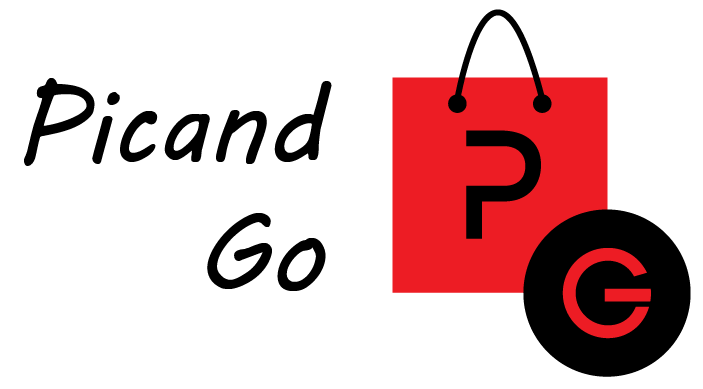

# Picand Go



A sua comida está mais perto e nos melhores locais de restauração.\
Nunca mais fique longe da sua comida favorita!

Picand Go é uma aplicação desenvolvida em ambiente Web com ajuda de Node.js para o back-end. No quesito de preservar os dados foi elaborado com SQLite, um sistema de gestão para a base de dados.

> Esta não é um aplicação oficializada no mercado, foi construida no âmbito académico de forma aumentar as nossas capacidades técnicas e interpessoais.


## Pré-Requisitos

Tudo o que você precisa para usar o software é instalar o [Node.js](https://nodejs.org).


## Instalação

Para colocar o projeto a funcionar localmente na sua máquina basta:

1. Clonar o repositório.

2. Abrir a linha de comandos.

3. Ir para a pasta do projeto:
   ```sh
   cd "pasta_do_projeto"
   ```

4. Instalar todos os pacotes e dependências necessárias do projeto (apenas necessário uma vez quando se faz clone do repositório):
   ```sh
   npm install
   ```

5. Iniciar servidor:
   ```sh
   npm start
   ```

6. Abrir no browser:
   ```sh
   http://localhost:8080
   ```


## API

É graças à API que o software se comunica com o servidor, possibilitando a interação com a base de dados e o armazenamento de ficheiros.

Pode aceder facilmente à documentação da mesma através da seguinte página do nosso [GitHub Pages](https://luispereira1999.github.io/picand-go).
Aqui você encontrará uma explicação clara e detalhada para efetuar essa comunicação.


## Contribuições

As contribuições são o que tornam a comunidade de código aberto um lugar incrível para aprender, inspirar e criar. Quaisquer contribuições que você faça são muito apreciadas.

Se você tiver uma sugestão de melhoria, por favor, faça fork do repositório e crie uma pull request. Ou pode simplesmente abrir um issue. Não se esqueça de dar uma estrela ao projeto! Obrigado mais uma vez!


## Colaboradores

- João Antunes
- Luís Pereira
- Rui Pinto


## Licença

Ao contribuir para este projeto, você concorda com as políticas da licença MIT.
